## Изучите [README.md](README.md) файл и структуру проекта.

## Задание 1

[Диаграмма C4 Containers](docs/C4_diagrams/C4_Containers.puml)

## Задание 2

### 1. Proxy

[Сервис](src/microservices/proxy/) реализован на "голой" java

### 2. Kafka

[Сервис](src/microservices/events/) реализован на Java + Spring Boot

тесты проходят

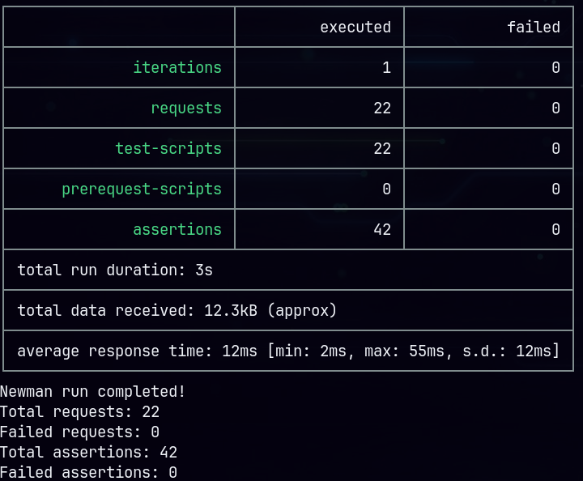

логи events service

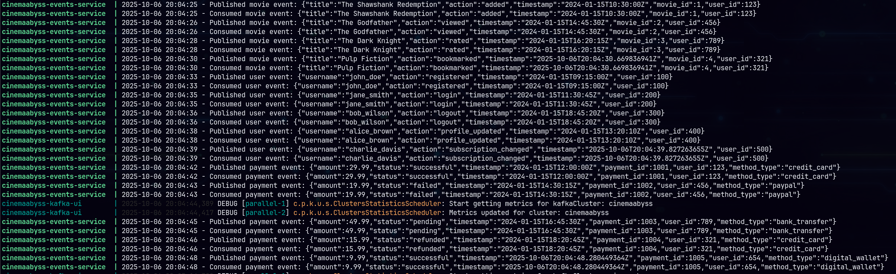

топики Kafka после тестов

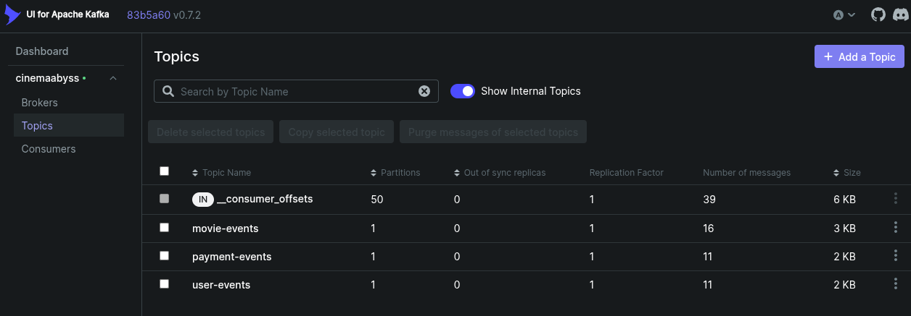

## Задание 3

[Github actions](.github/workflows/) реализованы

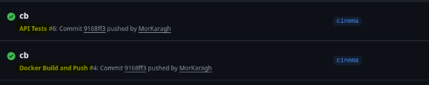

### Proxy в Kubernetes

Система развернута в k8s

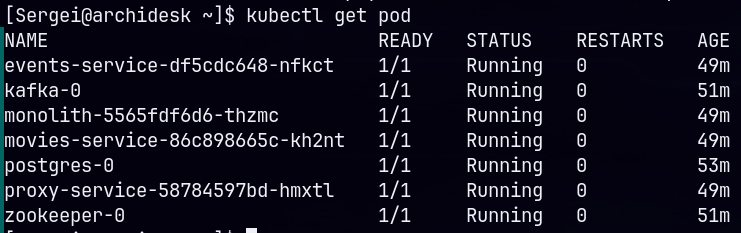
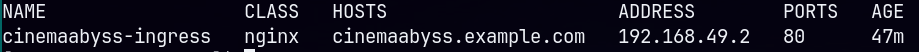

movies отвечает

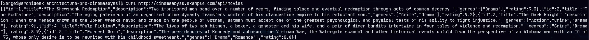

логи event service пишутся

## Задание 4

[Helm chart](src/kubernetes/helm/) реализован

всё устанавливается

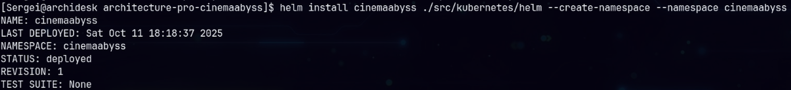

movies отвечает

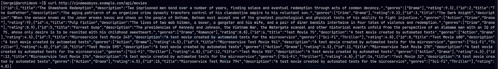

тесты проходят

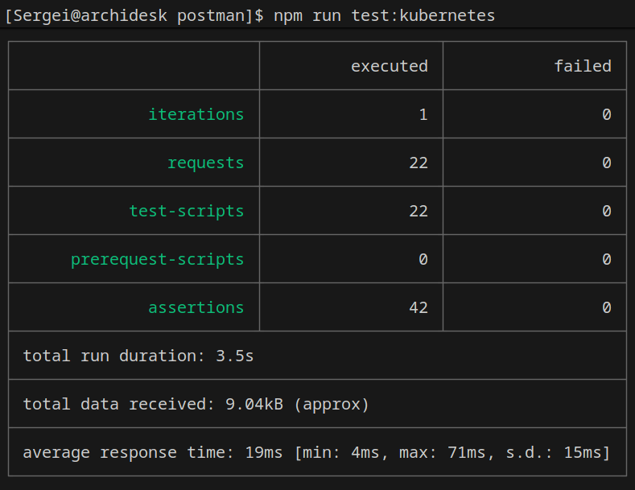

# Задание 5

istio поставил, circuit breaker работает

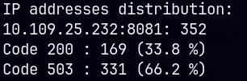

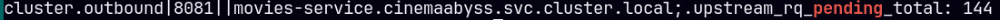